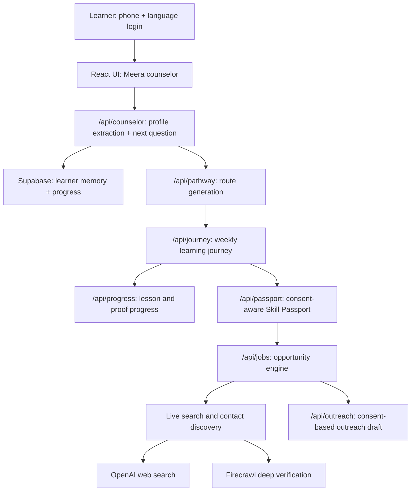

# VidyaSetu MVP

VidyaSetu is a voice-first AI career bridge for rural, low-income, first-generation, and other disadvantaged learners. The MVP helps a learner speak or type naturally, builds a structured learner profile, recommends a personalized pathway, turns that pathway into a weekly learning journey, preserves progress, creates a consent-aware Skill Passport, and only then moves toward opportunity discovery or outreach.

Live app: https://vidyasetu-mvp.vercel.app

## Problem Statement

Learners from disadvantaged backgrounds face barriers across the skilling and career funnel:

- Low access to quality career guidance and skilling information.
- Language and digital-access gaps.
- Poor fit between learner context and recommended courses.
- Dropout because the journey is not paced around real constraints.
- Weak placement outcomes because proof, consent, and outreach are missing.

VidyaSetu addresses this as a full pathway-to-placement system, not just a course recommender.

## Current MVP Flow

1. **Language-first login**
   - The learner selects language before phone login.
   - The app does not assume Hindi by default.
   - Saved learner profiles can resume from the same phone login.

2. **AI counselor intake**
   - Meera, the AI counselor, asks one question at a time.
   - User can type or speak.
   - The counselor extracts profile facts: name, education stage, goal, location, time, device access, proof, commute, mobility, urgency, and language preference.
   - If the learner changes goal later, the latest message wins.

3. **Personalized pathway generation**
   - The system classifies the learner into the right route family:
     - school study support
     - board exam preparation
     - JEE or entrance exam preparation
     - vocational training
     - informal skill validation
     - formal job search
     - college internship or placement
     - startup or founder outreach
     - self-employment or enterprise setup
   - Study-only learners are not pushed into job outreach.
   - Offline recommendations require location and commute context.

4. **Learning journey**
   - Selected pathway becomes a weekly journey.
   - Journey includes modules, daily practice, micro-tasks, proof tasks, progress tracking, support notes, and unlock logic.
   - Course completion is not treated as passive watching. The learner must complete tasks and proof.

5. **Skill Passport**
   - Builds a consent-scoped proof package.
   - Designed for learners with certificates, projects, informal work proof, or voice/photo/sample proof.
   - Outreach or sharing is gated behind consent.

6. **Opportunity engine**
   - Job, apprenticeship, training, startup-outreach, RPL, and enterprise paths are separated.
   - The system does not fabricate jobs.
   - If live opportunities are not verified yet, it shows source tasks, missing proof/resume, and safe next actions instead of fake cards.
   - Firecrawl is used only for deeper verification or contact discovery to protect credits.

## Architecture



## Tech Stack

- **Frontend:** React 19, Vite, Lucide icons, responsive CSS.
- **Hosting:** Vercel static frontend plus serverless API functions.
- **Database:** Supabase REST for learners, progress, passports, and outreach state.
- **Primary reasoning LLM:** Anthropic Claude, used for higher quality counseling and structured reasoning.
- **Fallback LLM:** OpenAI and Fireworks where configured.
- **Live search:** OpenAI web search for broad discovery.
- **Deep web/contact verification:** Firecrawl, used sparingly and only where needed.
- **Voice:** Browser speech recognition/playback first, Sarvam STT/TTS fallback for Indian language accessibility.
- **Email outreach:** AgentMail placeholder is wired conceptually, but production sending remains disabled until a real key is added.

## API Layer

| File | Purpose |
| --- | --- |
| `api/signup.js` | Phone-based learner session, saved profile recovery, and multi-learner handling. |
| `api/counselor.js` | Meera counselor orchestration, profile extraction, language handling, and one-question-at-a-time intake. |
| `api/intake.js` | Voice/audio intake, Sarvam STT, and Sarvam TTS fallback via `action: "tts"`. |
| `api/pathway.js` | Personalized pathway recommendation with study/job/location guardrails. |
| `api/journey.js` | Converts a selected pathway into a structured learning journey. |
| `api/progress.js` | Saves lesson completion, proof notes, and journey progress. |
| `api/passport.js` | Creates the Skill Passport and consent-scoped proof package. |
| `api/resume.js` | Builds a truthful resume/profile summary from counselor facts. |
| `api/jobs.js` | Opportunity engine for jobs, training, proof-to-work, startup outreach, and enterprise setup. |
| `api/outreach.js` | Drafts outreach only after consent and readiness checks. |
| `api/adews.js` | Early warning support layer for dropout, safety, and learner risk signals. |
| `api/health.js` | Shows configured service status and AI policy. |

Shared server helpers are in `api/_lib/`:

- `http.js`: request/response utilities.
- `supabase.js`: Supabase REST wrapper.
- `services.js`: LLM, Sarvam, OpenAI search, and Firecrawl service wrappers.
- `language.js`: language detection, same-language response policy, STT/TTS metadata.
- `mvp.js`: deterministic knowledge base, route templates, journey templates, guardrails, and fallback logic.

## Frontend Structure

| File | Purpose |
| --- | --- |
| `src/App.jsx` | Main product shell, counselor UI, profile card, pathways, journey, passport, jobs, CRM, support, and evaluation proof. |
| `src/main.jsx` | React app bootstrapping. |
| `src/styles.css` | Responsive product UI, mobile bottom nav, counselor avatar, pathway cards, journey views, and accessibility states. |

The UI is intentionally mobile-first because the target learner is likely to use a phone, shared device, low-data browser, or voice input.

## Environment Variables

Create `.env.local` for local development. Do not commit real keys.

```bash
SUPABASE_REST_URL=https://your-project.supabase.co/rest/v1
SUPABASE_SERVICE_KEY=replace-with-service-role-key
OPENAI_API_KEY=replace-with-openai-key
ANTHROPIC_API_KEY=replace-with-anthropic-key
SARVAM_API_KEY=replace-with-sarvam-key
FIREWORKS_API_KEY=replace-with-fireworks-key
FIRECRAWL_API_KEY=replace-with-firecrawl-key
AGENTMAIL_API_KEY=placeholder
WHATSAPP_SENDER_ID=replace-with-demo-sender-number
```

Optional cost controls:

```bash
OPENAI_JOB_SEARCH_QUERY_LIMIT=1
FIRECRAWL_JOB_SEARCH_LIMIT=2
ENABLE_FIRECRAWL_STARTUP_AUTO=false
ENABLE_FIRECRAWL_SCRAPE=false
MODEL_JSON_TIMEOUT_MS=12000
OPENAI_SEARCH_TIMEOUT_MS=10000
FIRECRAWL_TIMEOUT_MS=8000
SARVAM_TTS_TIMEOUT_MS=12000
```

## Local Development

```bash
npm install
npm run build
npm run serve:mvp
```

Open:

```bash
http://localhost:4175
```

For development with Vite:

```bash
npm run dev
```

## Verification

The repository includes automated smoke and benchmark scripts:

```bash
npm run build
node scripts/persona-e2e-test.mjs
npm run benchmark:slice3
npm run benchmark:slice4
npm run benchmark:slice5
npm run benchmark:slice6
```

The current persona suite covers school, Class 12, JEE switch, dropout tailoring, ITI electrician, nursing, mobile repair, BTech data science, no-location job, no-location training, informal mechanic, driver, hospitality, design, agri drone, and open counseling cases.

## Responsible AI and Product Guardrails

- No fake jobs or fabricated employer contacts.
- No offline recommendation without location or mobility context.
- Study-first learners remain study-first until they explicitly ask for career or job mode.
- Same-language counseling is preserved across text, speech, and pathway outputs.
- Outreach is blocked until proof and consent are ready.
- Shared-phone and returning-profile flows are supported.
- Firecrawl is credit-safe and used only for deep verification, not every request.

## Current Limitations

- AgentMail sending is still a placeholder until a real production key is configured.
- Live opportunity quality depends on available public sources and configured search providers.
- Voice playback may fall back to Sarvam if browser speech is unavailable.
- This is a hackathon MVP and demo-ready system, not a fully field-tested deployment.

## Deployment

The app is configured for Vercel:

```bash
npx vercel deploy --prod
```

Production alias:

```bash
https://vidyasetu-mvp.vercel.app
```
