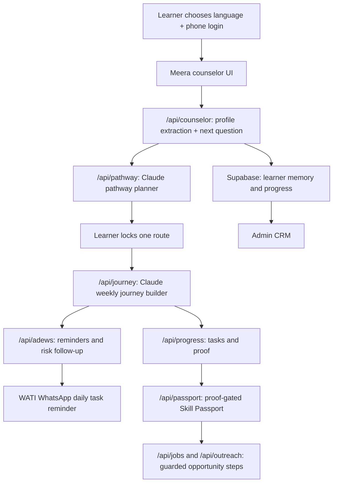

# VidyaSetu MVP

VidyaSetu is a voice-first, vernacular AI livelihood and education bridge for first-generation, rural and low-income learners in India. The MVP helps a learner speak naturally with Meera, creates a persistent learner profile, generates practical pathways, lets the learner lock one route, turns that route into a weekly learning journey, sends daily WhatsApp task reminders, gates the Skill Passport behind proof, and gives admins a CRM view for follow-up.

Live MVP: https://vidyasetu-mvp.vercel.app

## Final Submission Links

- Repository guide: `../README.md`
- Complete user flow: `END_TO_END_USER_FLOW.md`
- Final demo video: `docs/demo/VidyaSetu_Final_One_Persona_Demo.mp4`
- Final judge deck: `docs/VidyaSetu_AI_Final_Deck.pdf`
- Evaluation report: `docs/VidyaSetu_Evaluation_Report.pdf`
- Deployment and sustainability report: `docs/VidyaSetu_Final_Deployment_And_Sustainability.pdf`

## What Is Built Now

1. **Language-first login:** Learners choose language before phone login. Returning learners recover saved profile, chat memory, pathway, journey and progress.
2. **Meera counselor:** Meera asks one question at a time, answers direct learner questions, and silently builds the structured profile from chat or voice.
3. **Claude pathway planner:** Claude generates three practical routes from the learner profile, goal, education, location, time, proof and mobility constraints.
4. **Pathway lock:** Learners can compare routes freely. The route is locked only when they click the lock-and-create-journey button.
5. **Learner journey:** The locked route becomes a week-by-week plan with daily tasks, resources, proof tasks and unlock logic.
6. **Sarvam voice layer:** STT/TTS supports Indian-language voice-first use, with browser fallback when needed.
7. **WATI reminders:** After a journey exists, VidyaSetu can send daily WhatsApp task reminders using the approved WATI template.
8. **Skill Passport:** The passport stays locked until learning proof is completed. It is consent-controlled and shareable only when the learner is ready.
9. **Opportunity guardrails:** The platform does not fabricate jobs, employers, contacts, salaries, schemes, loans or guarantees.
10. **Admin CRM:** Admins can view learner records, profile state, journey status, proof/passport readiness, ADEWS risk and reminder status.

## Complete User Flow

The primary evaluation flow is documented in:

```text
END_TO_END_USER_FLOW.md
```

Short version: Riya, a Class 12 learner near Varanasi, logs in by phone, speaks to Meera in Hinglish, builds a profile for computer basics, typing and customer-service work, chooses and locks one pathway, receives a 4-week learning journey, gets daily WhatsApp task reminders, saves proof, unlocks a consent-controlled Skill Passport, and then sees only verified or source-backed opportunity steps.

## Architecture



## Tech Stack

- Frontend: React 19, Vite, Lucide icons, responsive CSS.
- Hosting: Vercel static frontend plus serverless API functions.
- Database: Supabase REST for learners, conversations, journeys, progress, passports, reminders and CRM data.
- AI reasoning: Anthropic Claude for counselor, pathway generation, journey generation, resume/proof and structured JSON planning.
- Voice: Sarvam STT/TTS, with browser fallback.
- WhatsApp reminders: WATI approved template plus Vercel cron.
- Search and verification: Claude web-search path and guarded source review; Firecrawl remains optional/deep verification only.

## API Layer

| File | Purpose |
| --- | --- |
| `api/signup.js` | Phone login, learner restoration and admin login. |
| `api/counselor.js` | Meera counselor, one-question intake, memory and profile extraction. |
| `api/intake.js` | Sarvam STT/TTS and voice metadata. |
| `api/pathway.js` | Personalized pathway generation and source guardrails. |
| `api/journey.js` | Converts the locked pathway into a weekly learning journey. |
| `api/progress.js` | Saves lesson completion, proof notes and progress. |
| `api/passport.js` | Builds the proof-gated, consent-controlled Skill Passport. |
| `api/jobs.js` | Guarded opportunity discovery and source review. |
| `api/outreach.js` | Consent-based outreach draft flow. |
| `api/adews.js` | Daily reminders, ADEWS risk status and worker alert support. |
| `api/health.js` | Service health and AI configuration status. |

Shared helpers live in `api/_lib/`:

- `services.js`: Claude, Sarvam, WATI, Firecrawl and HTTP service wrappers.
- `mvp.js`: pathway/journey validation, guardrails and structured MVP helpers.
- `language.js`: language detection, voice code and same-language policy.
- `supabase.js`: Supabase REST wrapper.
- `http.js`: request/response utilities.

## Local Setup

```bash
cd VidyaSetu-MVP
npm install
cp .env.example .env.local
```

Fill `.env.local` with your own keys. Never commit secrets.

Required for full functionality:

```text
ANTHROPIC_API_KEY=...
SUPABASE_REST_URL=...
SUPABASE_SERVICE_KEY=...
SARVAM_API_KEY=...
WATI_API_BASE_URL=...
WATI_API_TOKEN=...
WATI_TEMPLATE_NAME=vidyasetu_daily_task_reminder
```

Useful local controls:

```text
DISABLE_PATHWAY_WEB_SEARCH=true
DAILY_REMINDERS_LIVE_SEND=false
MODEL_JSON_TIMEOUT_MS=90000
PATHWAY_CLAUDE_TIMEOUT_MS=90000
JOURNEY_CLAUDE_TIMEOUT_MS=90000
```

## Run Locally

```bash
npm run build
npm run serve:mvp
```

Open:

```text
http://localhost:4175
```

For Vite development:

```bash
npm run dev
```

## Tests And Benchmarks

From `VidyaSetu-MVP/`:

```bash
npm run build
TEST_BASE_URL=http://localhost:4175 node scripts/persona-e2e-test.mjs
SLICE5_BASE_URL=http://localhost:4175 node scripts/slice5-journey-progress-benchmark.mjs
SLICE6_BASE_URL=http://localhost:4175 node scripts/slice6-final-smoke.mjs
```

For fast local tests, run the server with:

```bash
DISABLE_PATHWAY_WEB_SEARCH=true npm run serve:mvp
```

## Responsible AI Guardrails

- No fake jobs, employers, contacts, salaries, scheme approvals or loan approvals.
- Offline actions require location and safe commute context.
- Pathway can be inspected before locking; locking happens only on explicit learner action.
- Skill Passport is proof-gated and consent-controlled.
- Outreach remains blocked until proof and learner consent are ready.
- Firecrawl is not used on every request; it is reserved for deeper verification.
- Shared-phone and returning-profile flows preserve learner memory.

## Deployment

Production app:

```text
https://vidyasetu-mvp.vercel.app
```

Manual production deploy:

```bash
npx vercel deploy --prod -y
```
